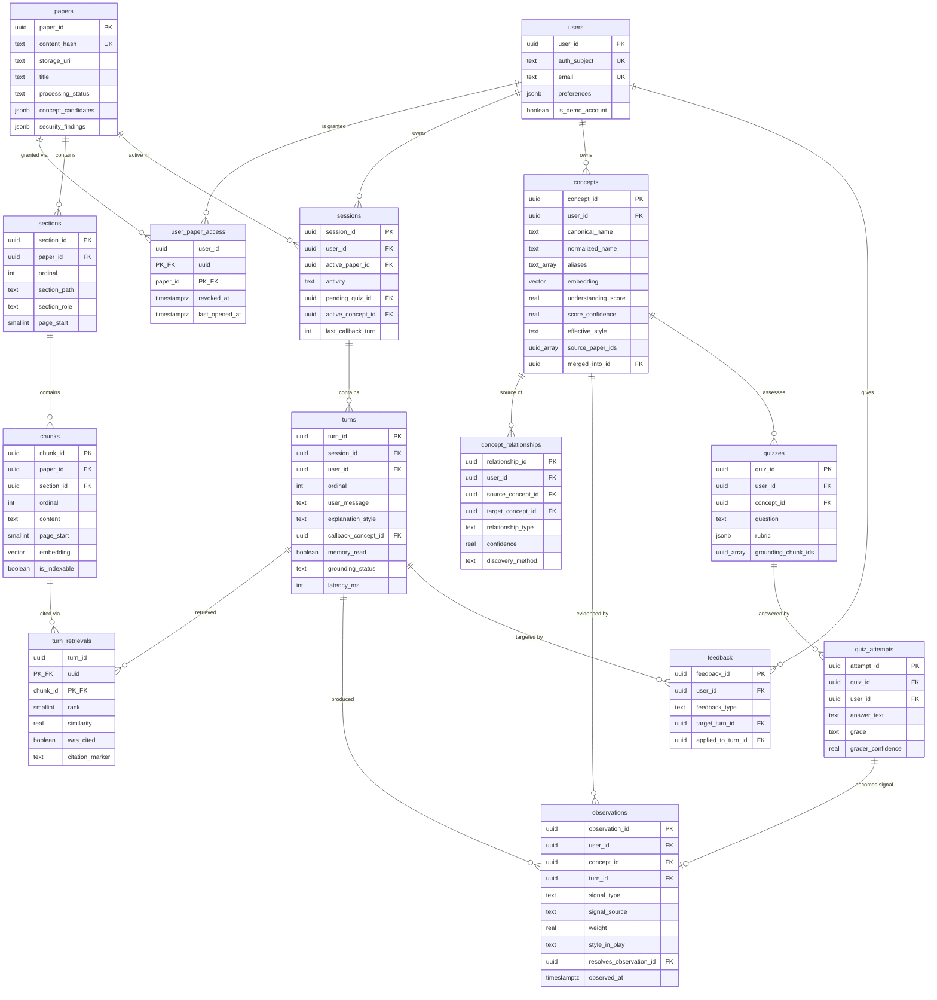
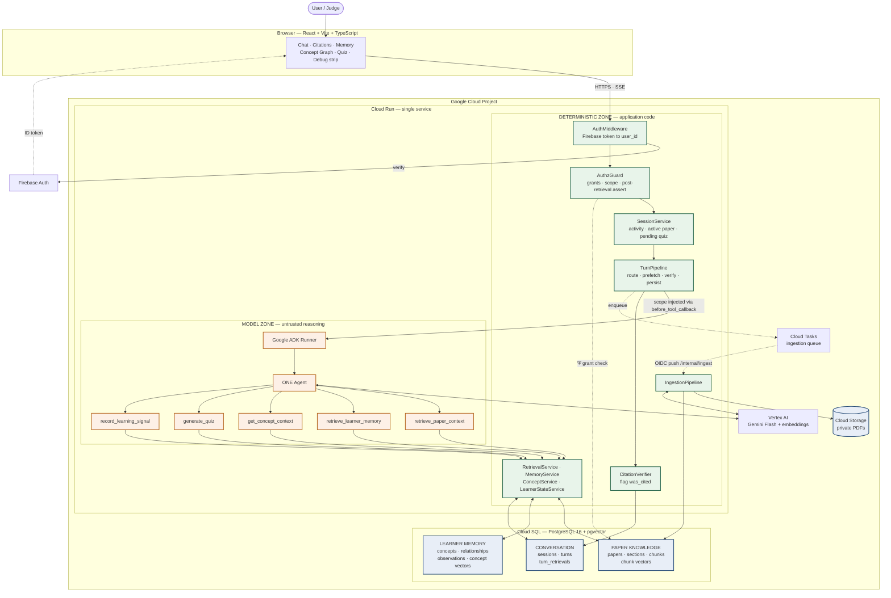
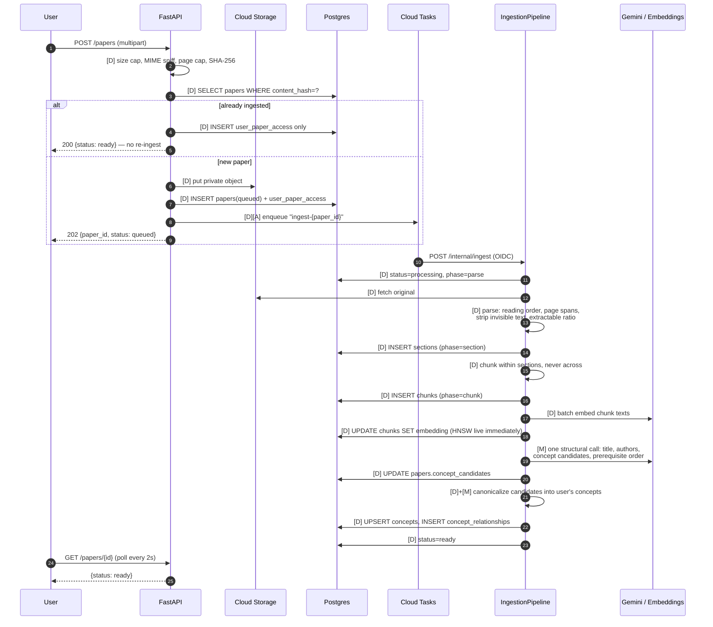
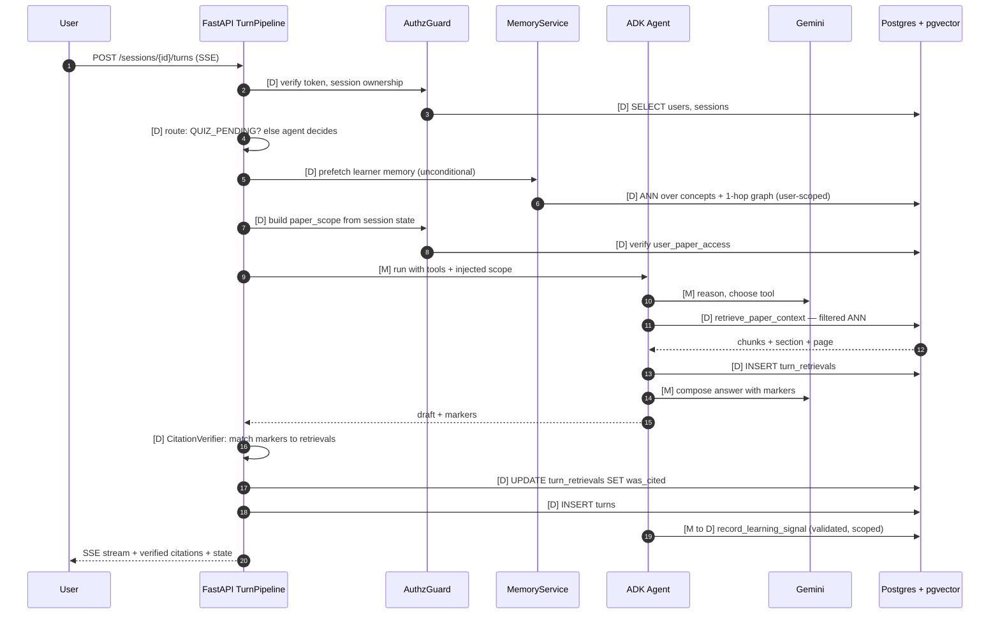
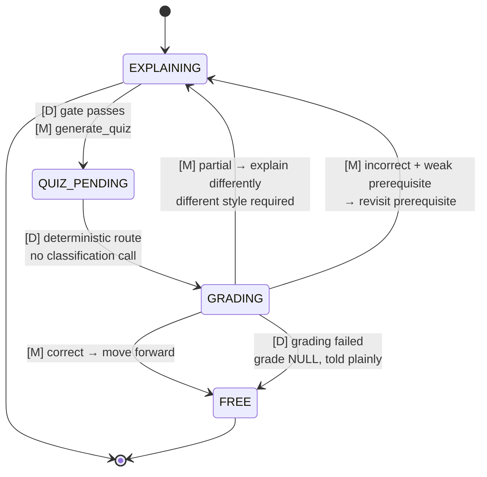
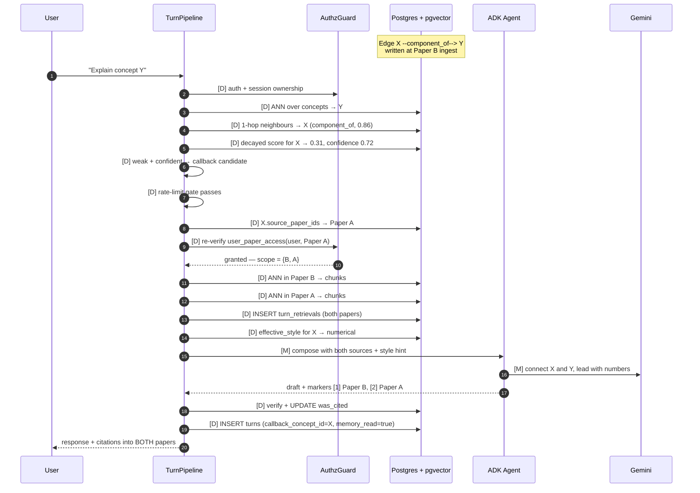
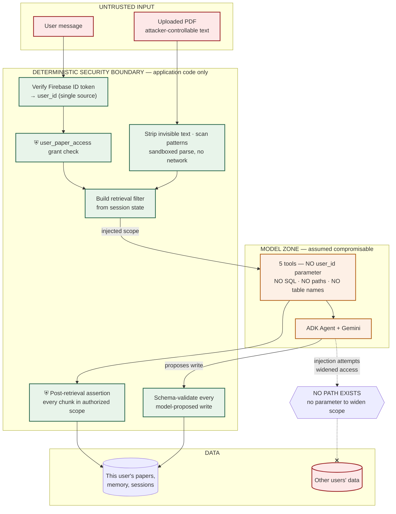

# SYSTEM ARCHITECTURE — Research Paper Reading Companion

**Status:** Scope-locked implementation architecture. **Supersedes `docs/ARCHITECTURE.md` Sections 0–2** where the two disagree.
**Constraint layer:** `Claude_Code_Project_Handoff_and_Scope_Lock.docx`
**Source of truth:** `docs/PROJECT_REQUIREMENTS.md` · `docs/REQUIREMENTS_TRACEABILITY.md`
**Implementation state:** No application code. No dependencies installed. No infrastructure provisioned.
**Date:** 2026-08-13

`[D]` deterministic · `[M]` model-driven · `[A]` asynchronous · `⛨` authorization checkpoint

---

# 1. Executive Architecture Summary

**One Cloud Run service. One ADK agent. One Postgres database. Five tools. Fourteen tables.**

A React SPA talks HTTPS to a FastAPI service on Cloud Run. FastAPI owns identity, authorization, retrieval scope, persistence and citation verification. Inside it, a single Google ADK agent backed by one Flash-class Gemini model chooses among five scoped tools. PostgreSQL with `pgvector` holds everything — paper knowledge and learner memory in the same database, vectors alongside the metadata that filters them. Cloud Storage holds the private PDF originals and nothing else.

**What the scope lock changed from the previous architecture pass:**

| Previous | Now | Why |
| --- | --- | --- |
| 25 tables | **14 tables** | `citations` merged into `turn_retrievals`; `paper_concepts`, `concept_aliases`, `concept_sources`, `ingestion_jobs`, `understanding_snapshots`, `style_effectiveness`, `learner_preferences`, 3 learning-path tables, `embedding_cache` all removed or demoted |
| 9 agent tools | **5 agent tools** | Grading, canonicalization, linking and planning move to deterministic backend logic — they were never model-judgement calls in the first place |
| 2 Cloud Run services (`api` + `worker`) | **1 Cloud Run service** | Cloud Tasks pushes back to the same service on an internal route |
| 7-stage chained ingestion pipeline | **1 job, 6 phases in-process** | Stages were already idempotent; chaining bought nothing and cost a table plus six enqueue hops |
| 2 sync LLM calls per turn + 1 async | **1 sync LLM call per turn** | Intent classification deleted — **the agent's tool choice *is* the routing**. Post-turn extraction deleted — the agent records signals via a tool, with a deterministic backstop |
| ADK owns session state | **We own session state; ADK owns message history** | Removes the dangling-reference ambiguity (`MM-6`) and gives every field exactly one source of truth |

**What did not change:** the deterministic/model boundary, the security posture, fail-closed grounding, deterministic citation verification, provenance-aware learner memory, and the cross-paper concept callback. Those are the product; everything else was scaffolding.

**One architectural idea worth reading twice.** Merging `citations` into `turn_retrievals` as a `was_cited` flag did not just save a table — it made the `RG-32` groundedness rule *structurally unrepresentable to violate*. A citation is no longer a row that points at a retrieval; **a citation is a retrieval row that got flagged.** There is no schema through which the system can cite something it did not retrieve this turn. Simplification pressure produced a stronger guarantee than the more elaborate design it replaced.

---

# 2. Component Architecture

## 2.1 The nine components

### React + Vite SPA — **CORE**
**Responsibility:** the five demo-critical views — paper/chat with clickable citations, learner memory, concept graph, quiz, session debug strip.
**Why it exists:** persistent memory is invisible unless surfaced. A judge who cannot *see* the learner model change has not been shown persistent memory (`R2`).
**Talks to:** FastAPI over HTTPS, same origin (built assets are served by FastAPI — no CORS, no second deploy, one URL for judges).
**In:** user messages, uploads, quiz answers, feedback. **Out:** rendered conversation, citation overlays, memory records, graph, SSE token stream.

### FastAPI on Cloud Run — **CORE**
**Responsibility:** the deterministic half of the system. HTTP surface, Firebase token verification, authorization, retrieval filter construction, session state, persistence, citation verification, task enqueueing, static asset serving.
**Why it exists:** everything that must be *correct* rather than *plausible* lives here.
**Talks to:** browser, Postgres, Cloud Storage, Cloud Tasks, Vertex AI (via ADK).
**In:** authenticated HTTP requests. **Out:** JSON, SSE streams, signed GCS URLs.

### Google ADK — **CORE** (satisfies `HK-2`)
**Responsibility:** agent runtime — the `Agent`, the `Runner`, tool registration and dispatch, the tool callback hook that injects authorization scope, and the message-history session service.
**Why it exists:** mandatory Google Agent Framework, and its `before_tool_callback` is the natural enforcement point for `SEC-3`.
**Talks to:** FastAPI (embedded, in-process), Gemini via Vertex, the five tools.

### One Agent — **CORE**
**Responsibility:** decide what this learner needs next and which tool serves it.
**Why it exists:** the 40% "autonomous execution over simple chat queries" criterion. Its tool choice is where the agency is visible.
**Boundaries:** cannot determine identity, authorization, retrieval scope, weights, scores, or write to the database directly.

### Gemini (Flash-class, 3.5+) — **CORE** (satisfies `HK-1`)
**Responsibility:** semantic reasoning only — explanation composition, style adaptation, concept interpretation, tool selection, quiz generation, rubric grading, relationship typing.
**Why it exists:** these are judgement tasks with no deterministic formulation.
**Accessed via:** Vertex AI with workload identity — no long-lived API key, and requests appear in Cloud logs, which doubles as the `HK-10` deployment proof.

### PostgreSQL — **CORE** (satisfies `HK-3`)
**Responsibility:** single source of truth for paper knowledge, learner memory, sessions, turns, retrieval sets, quizzes and feedback.
**Why it exists:** the learner model needs foreign keys, transactions and replay-recomputation. Nothing else in the stack provides that.

### pgvector — **CORE**
**Responsibility:** ANN search over chunk embeddings and concept embeddings, **inside the same tables that hold the filters**.
**Why it exists:** `RG-25/26` requires retrieval filtered by user and by an enumerated paper set. In pgvector that is a `WHERE` clause evaluated inside the search; with a separate vector service it is a client-side post-filter that silently degrades recall.

### Cloud Storage — **CORE**
**Responsibility:** private originals, one bucket, uniform bucket-level access, no public objects, short-lived signed URLs to the owning user only.
**Why it exists:** `SEC-27`. Binary blobs do not belong in the database.

### Cloud Tasks — **CORE** (justified below)
**Responsibility:** one job type — ingestion — pushed over HTTPS with OIDC to an internal route on the same Cloud Run service.
**Why it exists, tested against the scope-lock's three questions:** (1) `RG-3`/`RG-5` require asynchronous ingestion with retry — yes, P0. (2) The ingestion progress UI is on camera — yes, visible. (3) Without durable retry, a reclaimed Cloud Run instance leaves a paper stuck in `queued` forever and Journey A breaks — yes, removing it breaks a core journey.
**The alternative considered and rejected:** FastAPI `BackgroundTasks`. Work started in-process dies when Cloud Run reclaims the instance — a silent data-loss path, not a simplification. Cloud Tasks is one managed queue with no server to run.

## 2.2 Deterministic vs. model responsibilities

**The model must not control:** user identity, authorization, retrieval scope, database writes, SQL, file paths, observation weights, understanding scores, citation validity, rate limits.

| Deterministic `[D]` — application code | Model-driven `[M]` — Gemini |
| --- | --- |
| Firebase token verification → `user_id` | Which tool to call, and with what query |
| `user_paper_access` grant checks (`⛨`) | Explanation composition and phrasing |
| Retrieval filter construction from session state | Whether to surface a retrieved memory now |
| Relevance floor, top-k, dedup, post-retrieval assertion | Concept identity adjudication in the ambiguous band |
| Citation verification against this turn's retrieval set | Relationship typing |
| Observation weight assignment from `(signal_type, source)` | Signal classification into the closed vocabulary |
| Understanding score arithmetic and decay | Quiz question + rubric generation |
| Alias exact-match and ANN candidate generation | Rubric-based grading verdict |
| Confidence thresholding before any commit | Diagnosis: vocabulary gap vs. prerequisite gap |
| Callback rate limiting and suppression | Explanation style selection *among ranked options* |
| Every database write | — |

**The governing pattern**, applied in three places (canonicalization, callback selection, relationship discovery):

```
[D] deterministic recall  →  [M] model adjudication  →  [D] deterministic commit
```

The model proposes; application code commits. Every model output that causes a write is schema-validated and passes a deterministic gate.

---

# 3. Component Responsibility Table

| Component | Responsibility | Communicates with | Data in | Data out | Class |
| --- | --- | --- | --- | --- | --- |
| React + Vite SPA | Demo-critical UI: chat, citations, memory, graph, quiz, debug strip | FastAPI (HTTPS/SSE) | Messages, uploads, answers, feedback | Rendered views | **CORE** |
| FastAPI | HTTP surface, auth, authz, scope, persistence, citation verification | Browser, Postgres, GCS, Cloud Tasks, ADK | Authenticated requests | JSON, SSE, signed URLs | **CORE** |
| `AuthMiddleware` | Verify Firebase ID token → `Principal(user_id)` | Firebase JWKS, `users` | Bearer token | Principal | **CORE** |
| `AuthzGuard` | Grant checks, filter construction, post-retrieval assertion | `user_paper_access` | `user_id`, paper ids | Verified scope, or raise | **CORE** |
| `SessionService` | Session lifecycle, activity state, ownership | `sessions` | `session_id` | Session state | **CORE** |
| `TurnPipeline` | The deterministic wrapper around the agent | ADK, `RetrievalService`, `CitationVerifier` | Message + state | Persisted turn + stream | **CORE** |
| ADK `Runner` + Agent | Tool selection and dispatch; message history | Gemini, 5 tools | Context + tools | Draft response + tool calls | **CORE** |
| Gemini (Flash-class) | Semantic reasoning | ADK | Prompt + tool results | Text, structured output | **CORE** |
| `RetrievalService` | Filtered ANN over chunks; relevance floor; dedup | Postgres/pgvector | Query + scope | Chunks + metadata | **CORE** |
| `MemoryService` | Concept ANN, 1-hop graph read, weak-concept filter | Postgres | Query + `user_id` | Compact memory records | **CORE** |
| `ConceptService` | Canonicalize, link, commit — recall→adjudicate→commit | Postgres, Gemini | Concept mentions | Concept ids, edges | **CORE** |
| `LearnerStateService` | Weights, score arithmetic, decay, style ranking | Postgres | Observations | Scores + confidence | **CORE** |
| `CitationVerifier` | Flag retrieval rows as cited; strip unverifiable markers | `turn_retrievals` | Draft + retrieval set | Verified citations | **CORE** |
| `QuizService` | Generate grounded checks; grade against stored rubric | Postgres, Gemini | Concept + chunks / answer | Quiz / grade | **CORE** |
| `IngestionPipeline` | Validate → parse → section → chunk → embed → analyze | GCS, Postgres, Vertex | PDF | Chunks, vectors, candidates | **CORE** |
| PostgreSQL + pgvector | Single datastore | Everything | Rows + vectors | Rows + vectors | **CORE** |
| Cloud Storage | Private originals | FastAPI | PDF bytes | Signed URLs | **CORE** |
| Cloud Tasks | Durable async ingestion with retry | FastAPI ↔ FastAPI | Task payload | HTTPS push | **CORE** |
| Firebase Auth | Identity provider | Browser, FastAPI | Credentials | ID token | **CORE** |
| Structured logging | `turn_id`-correlated JSON to Cloud Logging | Cloud Logging | Log records | Searchable logs | **CORE** |
| Postgres RLS | Data-layer isolation second line | Postgres | — | — | **NICE-TO-HAVE** |
| `embedding_cache` table | Avoid re-embedding identical text | Postgres | Hash | Vector | **NICE-TO-HAVE** |
| Session consolidation job | End-of-session summary + polish | Postgres, Gemini | Session | Summary | **NICE-TO-HAVE** |
| Learning-path tables | Persisted multi-step syllabus | Postgres | — | — | **CUT** |
| Second Cloud Run service | Separate worker | — | — | — | **CUT** |
| `ingestion_jobs` table | Per-stage retry records | — | — | — | **CUT** |
| Intent-classification LLM call | Separate routing call | — | — | — | **CUT** |
| OpenTelemetry → Cloud Trace | Trace waterfalls | — | — | — | **NICE-TO-HAVE** (free if ADK emits it) |

---

# 4. Database Schema

**PostgreSQL 16 · extensions `pgvector`, `pgcrypto` · 14 tables.**

Conventions: `UUID` PKs (`gen_random_uuid()`), `TIMESTAMPTZ` timestamps, enumerations as `TEXT` + `CHECK` (editable in a one-line migration, unlike native enums), `vector(768)` from `gemini-embedding-001` with reduced output dimensionality. `user_id` leads every composite index — an index scan can never *begin* by touching another user's rows.

### Closed vocabularies

| Vocabulary | Values |
| --- | --- |
| `processing_status` | `queued, processing, ready, partially_ready, failed` |
| `section_role` | `abstract, introduction, related_work, method, experiments, results, discussion, conclusion, references, appendix, unknown` |
| `activity` | `FREE, EXPLAINING, QUIZ_PENDING, AWAITING_CLARIFICATION` |
| `explanation_style` | `formal, intuitive, numerical, analogical, visual_verbal, code, contrastive` |
| `signal_type` | `explicit_confusion, implicit_confusion, explicit_understanding, quiz_correct, quiz_partial, quiz_incorrect, applied_correctly, user_stated_known, user_stated_unknown, reinforcement` |
| `signal_source` | `explicit, implicit, quiz, user_stated, system` |
| `relationship_type` | `prerequisite_of, component_of, specialisation_of, contrasts_with, equivalent_notation, co_occurs_with` |
| `grade` | `correct, partial, incorrect` |
| `feedback_type` | `helpful, not_helpful, too_basic, too_advanced, wrong, style_preference` |

---

### 4.1 `users`

| Column | Type | Null | Key | Constraints | Notes |
| --- | --- | --- | --- | --- | --- |
| `user_id` | `UUID` | NOT NULL | PK | `gen_random_uuid()` | Never client-supplied |
| `auth_subject` | `TEXT` | NOT NULL | UK | ≤128 | Firebase `uid` — the only link to the IdP |
| `email` | `TEXT` | NULL | UK | lower-cased | Minimal PII |
| `display_name` | `TEXT` | NULL | | ≤128 | |
| `preferences` | `JSONB` | NOT NULL | | `'{}'` | Verbosity, formality, quiz appetite, proactivity tolerance, `personalization_enabled` |
| `is_demo_account` | `BOOLEAN` | NOT NULL | | `false` | Reset-script target |
| `created_at` | `TIMESTAMPTZ` | NOT NULL | | `now()` | |

**Indexes:** PK; `UNIQUE(auth_subject)` — the highest-frequency query in the system; `UNIQUE(email) WHERE email IS NOT NULL`.
**Deliberately absent:** any demographic, sensitive or inferred personal attribute (`PZ-8`). There is nowhere to put one.

### 4.2 `user_paper_access`

| Column | Type | Null | Key | Constraints | Notes |
| --- | --- | --- | --- | --- | --- |
| `user_id` | `UUID` | NOT NULL | PK, FK→`users` | `ON DELETE CASCADE` | |
| `paper_id` | `UUID` | NOT NULL | PK, FK→`papers` | `ON DELETE CASCADE` | |
| `added_at` | `TIMESTAMPTZ` | NOT NULL | | `now()` | |
| `nickname` | `TEXT` | NULL | | ≤200 | User-local label |
| `last_opened_at` | `TIMESTAMPTZ` | NULL | | | Journey F orientation |
| `revoked_at` | `TIMESTAMPTZ` | NULL | | | Read-time authorization sees revocation immediately |

**Indexes:** PK `(user_id, paper_id)` — **the authorization check on every retrieval**; `(user_id, last_opened_at DESC) WHERE revoked_at IS NULL`; `(paper_id)`.
**Why it exists:** possessing a `paper_id` grants nothing. This join is the only thing that makes a paper visible, which is what lets two users share parsed chunks safely.

### 4.3 `papers`

| Column | Type | Null | Key | Constraints | Notes |
| --- | --- | --- | --- | --- | --- |
| `paper_id` | `UUID` | NOT NULL | PK | | |
| `content_hash` | `TEXT` | NOT NULL | UK | len 64 | SHA-256 — the idempotency key |
| `storage_uri` | `TEXT` | NOT NULL | | `gs://…` | Private object |
| `original_filename` | `TEXT` | NULL | | ≤512 | Display only, never used to build a path |
| `title` | `TEXT` | NULL | | ≤1000 | Extracted `[M]` |
| `authors` | `TEXT[]` | NULL | | | Display only, never filtered |
| `year` | `SMALLINT` | NULL | | 1900–2100 | |
| `page_count` | `SMALLINT` | NULL | | >0 | |
| `processing_status` | `TEXT` | NOT NULL | | `'queued'`, CHECK | Agent refuses paper questions unless `ready`/`partially_ready` |
| `processing_phase` | `TEXT` | NULL | | | Progress display and retry resume point |
| `error_code` | `TEXT` | NULL | | ≤64 | Typed, never a stack trace |
| `extractable_text_ratio` | `REAL` | NULL | | 0–1 | Scan detection |
| `unreadable_pages` | `SMALLINT[]` | NULL | | | Drives the honest partial message |
| `security_findings` | `JSONB` | NULL | | | Invisible-text spans stripped, injection pattern hits |
| `concept_candidates` | `JSONB` | NULL | | | **Shared, paper-scoped extraction output** — canonicalized per user into `concepts` |
| `embedding_model` | `TEXT` | NULL | | | Stored so a model change is a migration, not silent corruption |
| `created_at` / `updated_at` | `TIMESTAMPTZ` | NOT NULL | | `now()` | |

**Indexes:** PK; `UNIQUE(content_hash)`; `(processing_status) WHERE processing_status NOT IN ('ready','failed')` — partial index; the ingestion status query touches only live rows.
**No `user_id`.** Papers are artifacts, not user property. `user_paper_access` is the visibility mechanism.

### 4.4 `sections`

| Column | Type | Null | Key | Constraints | Notes |
| --- | --- | --- | --- | --- | --- |
| `section_id` | `UUID` | NOT NULL | PK | | |
| `paper_id` | `UUID` | NOT NULL | FK→`papers` | `ON DELETE CASCADE` | |
| `ordinal` | `INTEGER` | NOT NULL | | ≥0 | Document order |
| `heading` | `TEXT` | NULL | | ≤500 | As printed |
| `section_path` | `TEXT` | NOT NULL | | ≤200 | e.g. `3.2` — used verbatim in citations |
| `section_role` | `TEXT` | NOT NULL | | `'unknown'`, CHECK | `unknown` is the honest fallback, never a fabricated guess |
| `page_start` / `page_end` | `SMALLINT` | NOT NULL | | >0, end≥start | |

**Indexes:** PK; `UNIQUE(paper_id, ordinal)`; `(paper_id, section_role)`.
**Why it exists:** section-aware chunking is the schema decision that most improves retrieval precision, and `§3.2, p.5` is a citation a human can act on where `chunk 47` is not.

### 4.5 `chunks`

| Column | Type | Null | Key | Constraints | Notes |
| --- | --- | --- | --- | --- | --- |
| `chunk_id` | `UUID` | NOT NULL | PK | | The unit a judge clicks |
| `paper_id` | `UUID` | NOT NULL | FK→`papers` | `ON DELETE CASCADE` | |
| `section_id` | `UUID` | NOT NULL | FK→`sections` | `ON DELETE CASCADE` | **A chunk belongs to exactly one section — the no-crossing rule as an FK** |
| `ordinal` | `INTEGER` | NOT NULL | | ≥0 | Enables neighbour fetch |
| `content` | `TEXT` | NOT NULL | | 1–8000 chars | |
| `content_hash` | `TEXT` | NOT NULL | | len 64 | Dedup |
| `token_count` | `SMALLINT` | NULL | | >0 | Context budgeting |
| `page_start` / `page_end` | `SMALLINT` | NOT NULL | | >0 | **NOT NULL by design — a chunk without a page is uncitable** |
| `embedding` | `vector(768)` | NULL | | | Null until embedded |
| `is_indexable` | `BOOLEAN` | NOT NULL | | `true` | Reference entries and orphan captions excluded without being deleted |

**Indexes:**

| Index | Type | Serves |
| --- | --- | --- |
| `chunk_id` | PK | Citation resolution |
| `(paper_id, ordinal)` | unique btree | Neighbour fetch, idempotent re-ingest |
| `USING hnsw (embedding vector_cosine_ops) WHERE is_indexable AND embedding IS NOT NULL` | **partial HNSW** | ANN retrieval — unembedded and excluded chunks never enter the index |
| `(paper_id) WHERE is_indexable` | partial btree | Pre-filter |

**Cardinality:** ~100 per paper, ~5 000 total. Small enough that an exact filtered scan is the safe fallback if HNSW recall under a selective pre-filter disappoints.

### 4.6 `sessions`

| Column | Type | Null | Key | Constraints | Notes |
| --- | --- | --- | --- | --- | --- |
| `session_id` | `UUID` | NOT NULL | PK | | |
| `user_id` | `UUID` | NOT NULL | FK→`users` | `ON DELETE CASCADE` | Ownership checked on every turn |
| `active_paper_id` | `UUID` | NULL | FK→`papers` | `ON DELETE SET NULL` | Retrieval scope |
| `activity` | `TEXT` | NOT NULL | | `'FREE'`, CHECK | **Authoritative** — drives deterministic routing |
| `pending_quiz_id` | `UUID` | NULL | FK→`quizzes` | `ON DELETE SET NULL` | Set iff `activity = 'QUIZ_PENDING'` |
| `active_concept_id` | `UUID` | NULL | FK→`concepts` | `ON DELETE SET NULL` | Drives memory prefetch |
| `last_callback_turn` | `INTEGER` | NULL | | | Callback rate-limit denominator |
| `turn_count` | `INTEGER` | NOT NULL | | `0` | |
| `started_at` / `last_activity_at` | `TIMESTAMPTZ` | NOT NULL | | `now()` | |
| `ended_at` | `TIMESTAMPTZ` | NULL | | | |

**Constraint:** `CHECK ((activity = 'QUIZ_PENDING') = (pending_quiz_id IS NOT NULL))` — the state and its payload cannot disagree.
**Indexes:** PK; `(user_id, started_at DESC)`; `(last_activity_at) WHERE ended_at IS NULL`.
**Source-of-truth resolution:** these columns are **ours and authoritative**. ADK's session service holds message history only. Every field has exactly one owner — see §17.

### 4.7 `turns`

| Column | Type | Null | Key | Constraints | Notes |
| --- | --- | --- | --- | --- | --- |
| `turn_id` | `UUID` | NOT NULL | PK | | **Universal correlation id** — logs, traces, task payloads |
| `session_id` | `UUID` | NOT NULL | FK→`sessions` | `ON DELETE CASCADE` | |
| `user_id` | `UUID` | NOT NULL | FK→`users` | `ON DELETE CASCADE` | Denormalized deliberately — every hot query filters by user |
| `paper_id` | `UUID` | NULL | FK→`papers` | `ON DELETE SET NULL` | |
| `ordinal` | `INTEGER` | NOT NULL | | ≥0 | |
| `user_message` | `TEXT` | NULL | | ≤8000 | Kept for eval replay; assistant output is not duplicated |
| `agent_action` | `TEXT` | NULL | | | What the agent chose to do |
| `explanation_style` | `TEXT` | NULL | | CHECK | Style in play — later linked to resolution |
| `callback_concept_id` | `UUID` | NULL | FK→`concepts` | `ON DELETE SET NULL` | ≤1 per turn |
| `callback_suppressed_reason` | `TEXT` | NULL | | ≤64 | **Suppression is a feature and is measured** |
| `memory_read` | `BOOLEAN` | NOT NULL | | `false` | |
| `grounding_status` | `TEXT` | NOT NULL | | `'n/a'`, CHECK `grounded/no_evidence/degraded/n/a` | |
| `tools_called` | `TEXT[]` | NULL | | | Trajectory evidence — what the agent actually chose |
| `input_tokens` / `output_tokens` / `latency_ms` | `INTEGER` | NULL | | ≥0 | The metrics store — no separate system needed |
| `error_code` | `TEXT` | NULL | | ≤64 | |
| `created_at` | `TIMESTAMPTZ` | NOT NULL | | `now()` | |

**Constraints:** `UNIQUE(session_id, ordinal)` — idempotent writes on retry; **`CHECK (callback_concept_id IS NULL OR memory_read)`** — the system cannot record a proactive callback it had no memory read to ground it in.
**Indexes:** PK; `UNIQUE(session_id, ordinal)`; `(session_id, created_at)`; `(user_id, created_at DESC)`.
**Append-only:** `BEFORE UPDATE OR DELETE` trigger raises; the app role holds only `SELECT, INSERT`.

### 4.8 `turn_retrievals` — *retrieval set and citations in one table*

| Column | Type | Null | Key | Constraints | Notes |
| --- | --- | --- | --- | --- | --- |
| `turn_id` | `UUID` | NOT NULL | PK, FK→`turns` | `ON DELETE CASCADE` | |
| `chunk_id` | `UUID` | NOT NULL | PK, FK→`chunks` | `ON DELETE CASCADE` | |
| `rank` | `SMALLINT` | NOT NULL | | ≥1 | |
| `similarity` | `REAL` | NOT NULL | | −1..1 | Relevance floor applied before insert |
| `retrieval_query` | `TEXT` | NULL | | ≤1000 | The model-formulated query — invaluable for retrieval debugging |
| `was_cited` | `BOOLEAN` | NOT NULL | | `false` | **Set by the deterministic verifier after generation** |
| `citation_marker` | `TEXT` | NULL | | ≤16 | The `[1]` token rendered in the response |

**Constraint:** `CHECK ((citation_marker IS NOT NULL) = was_cited)`.
**Indexes:** PK `(turn_id, chunk_id)`; `(turn_id) WHERE was_cited` — render citations for a turn; `(chunk_id)` — "which turns cited this passage".

> **This is the citation-verification mechanism.** A citation is not a separate record pointing at a retrieval — **a citation *is* a retrieval row with `was_cited = true`.** There is no schema through which the system can cite a chunk it did not retrieve this turn. The verifier's only job is to flag rows; markers it cannot match to a row are stripped from the response.

### 4.9 `concepts` — *the differentiator*

| Column | Type | Null | Key | Constraints | Notes |
| --- | --- | --- | --- | --- | --- |
| `concept_id` | `UUID` | NOT NULL | PK | | |
| `user_id` | `UUID` | NOT NULL | FK→`users` | `ON DELETE CASCADE` | **Concepts are user-scoped, not a global ontology** |
| `canonical_name` | `TEXT` | NOT NULL | | ≤200, sanitised | Clearest full form |
| `normalized_name` | `TEXT` | NOT NULL | | ≤200 | Exact-match key |
| `aliases` | `TEXT[]` | NOT NULL | | `'{}'` | `{ELBO, evidence lower bound, variational lower bound}` |
| `description` | `TEXT` | NULL | | ≤2000 | Short gloss |
| `embedding` | `vector(768)` | NULL | | | ANN candidate generation |
| `understanding_score` | `REAL` | NULL | | 0–1 | **Derived cache** of the scoring function |
| `score_confidence` | `REAL` | NULL | | 0–1 | Modelled separately, so the agent can say "I'm not sure yet" |
| `evidence_count` | `SMALLINT` | NOT NULL | | `0` | |
| `effective_style` | `TEXT` | NULL | | CHECK | Derived cache of the best-performing style |
| `source_paper_ids` | `UUID[]` | NOT NULL | | `'{}'` | Which papers introduced it — drives callback scope expansion |
| `first_seen_at` | `TIMESTAMPTZ` | NOT NULL | | `now()` | |
| `last_reinforced_at` | `TIMESTAMPTZ` | NULL | | | **Decay reference point** |
| `user_override_score` | `REAL` | NULL | | 0–1 | Explicit correction overrides inference and is never silently overwritten |
| `merged_into_id` | `UUID` | NULL | FK self | `ON DELETE SET NULL` | **Reversible merge — never delete on merge** |

**Constraints:** `UNIQUE(user_id, normalized_name) WHERE merged_into_id IS NULL` — partial unique index, so a merged-away concept keeps its name without blocking the survivor; `CHECK (merged_into_id <> concept_id)`.
**Indexes:**

| Index | Serves |
| --- | --- |
| `UNIQUE(user_id, normalized_name) WHERE merged_into_id IS NULL` | **Canonicalization exact match — the zero-LLM-cost path** |
| `USING gin (aliases) ` | Alias containment lookup, same zero-cost path |
| `USING hnsw (embedding vector_cosine_ops) WHERE merged_into_id IS NULL` | Candidate generation, semantic memory retrieval |
| `(user_id, understanding_score) WHERE merged_into_id IS NULL AND score_confidence >= 0.3` | **Weak-concept query — the confidence floor is inside the index predicate**, so "low score we're unsure about" never surfaces as a claim |
| `USING gin (source_paper_ids)` | "Which of this user's concepts appear in paper P" — the callback query |

**Cardinality:** ~60 per active user.

### 4.10 `concept_relationships`

| Column | Type | Null | Key | Constraints | Notes |
| --- | --- | --- | --- | --- | --- |
| `relationship_id` | `UUID` | NOT NULL | PK | | |
| `user_id` | `UUID` | NOT NULL | FK→`users` | `ON DELETE CASCADE` | Traversal filters by user without joining both endpoints |
| `source_concept_id` | `UUID` | NOT NULL | FK→`concepts` | `ON DELETE CASCADE` | |
| `target_concept_id` | `UUID` | NOT NULL | FK→`concepts` | `ON DELETE CASCADE` | |
| `relationship_type` | `TEXT` | NOT NULL | | CHECK | Six types. Untyped edges are not representable |
| `confidence` | `REAL` | NOT NULL | | 0–1 | |
| `discovery_method` | `TEXT` | NOT NULL | | `embedding/model/user_stated` | |
| `evidence_turn_id` | `UUID` | NULL | FK→`turns` | `ON DELETE SET NULL` | Provenance |
| `discovered_at` | `TIMESTAMPTZ` | NOT NULL | | `now()` | Graph-evolution replay for the demo visual |

**Constraints:** `UNIQUE(user_id, source_concept_id, target_concept_id, relationship_type)`; `CHECK (source <> target)`; symmetric types stored **once** with canonical orientation `source_concept_id < target_concept_id` — storing both directions would double the edge count and make the type distribution lie.
**Indexes:** PK; the unique constraint; `(user_id, source_concept_id)` — forward traversal; `(user_id, target_concept_id)` — **reverse traversal, which is how "weak concept blocking the most downstream understanding" is computed**.

### 4.11 `observations` — *raw, immutable, append-only*

| Column | Type | Null | Key | Constraints | Notes |
| --- | --- | --- | --- | --- | --- |
| `observation_id` | `UUID` | NOT NULL | PK | | |
| `user_id` | `UUID` | NOT NULL | FK→`users` | `ON DELETE CASCADE` | Writes structurally cannot target another user |
| `concept_id` | `UUID` | NOT NULL | FK→`concepts` | `ON DELETE CASCADE` | |
| `session_id` | `UUID` | NULL | FK→`sessions` | `ON DELETE SET NULL` | Evidence outlives the conversation |
| `turn_id` | `UUID` | NULL | FK→`turns` | `ON DELETE SET NULL` | **Provenance — this is what makes memory inspectable** |
| `signal_type` | `TEXT` | NOT NULL | | CHECK | Closed vocabulary |
| `signal_source` | `TEXT` | NOT NULL | | CHECK | |
| `weight` | `REAL` | NOT NULL | | 0–1 | **Assigned deterministically by lookup, never by the model** |
| `style_in_play` | `TEXT` | NULL | | CHECK | Which style was being used when this happened |
| `resolves_observation_id` | `UUID` | NULL | FK self | `ON DELETE SET NULL` | **Links a resolution to the struggle it resolved** — the pair is the valuable signal |
| `quiz_attempt_id` | `UUID` | NULL | FK→`quiz_attempts` | `ON DELETE SET NULL` | |
| `note` | `TEXT` | NULL | | ≤500 | Human-readable evidence line shown in the memory UI |
| `observed_at` | `TIMESTAMPTZ` | NOT NULL | | `now()` | Decay reference |

**Indexes:** PK; **`(user_id, concept_id, observed_at DESC)`** — the derivation query; every score recomputation reads exactly this; `(concept_id) WHERE resolves_observation_id IS NOT NULL` — style-effectiveness aggregate; `(turn_id)`; `(user_id, observed_at DESC)` — memory timeline.
**Append-only trigger.** Written *during* the turn, never batched to session end — if the session dies, the learning signal survives.

### 4.12 `quizzes`

| Column | Type | Null | Key | Notes |
| --- | --- | --- | --- | --- |
| `quiz_id` | `UUID` | NOT NULL | PK | |
| `user_id` | `UUID` | NOT NULL | FK→`users` | |
| `concept_id` | `UUID` | NOT NULL | FK→`concepts` | What is being assessed |
| `paper_id` | `UUID` | NOT NULL | FK→`papers` | |
| `question` | `TEXT` | NOT NULL | ≤2000 | |
| `rubric` | `JSONB` | NOT NULL | object | Expected elements + acceptable variants — **generated with the question, graded against later** |
| `grounding_chunk_ids` | `UUID[]` | NOT NULL | ≥1 | **Mandatory** — a quiz not grounded in the paper tests world knowledge, not reading |
| `created_at` | `TIMESTAMPTZ` | NOT NULL | | |

**Indexes:** PK; `(user_id, concept_id, created_at DESC)` — the "checked recently?" gate.
**Durable by design:** grading must work even if the session expired.

### 4.13 `quiz_attempts` — *append-only*

| Column | Type | Null | Key | Notes |
| --- | --- | --- | --- | --- |
| `attempt_id` | `UUID` | NOT NULL | PK | |
| `quiz_id` | `UUID` | NOT NULL | FK→`quizzes` | |
| `user_id` | `UUID` | NOT NULL | FK→`users` | |
| `turn_id` | `UUID` | NULL | FK→`turns` | |
| `answer_text` | `TEXT` | NOT NULL | ≤4000 | |
| `grade` | `TEXT` | NULL | CHECK | **Null iff grading failed — we never guess a grade** |
| `missing_elements` | `TEXT[]` | NULL | | Structured grader output |
| `grader_confidence` | `REAL` | NULL | 0–1 | |
| `grading_error` | `TEXT` | NULL | ≤200 | |
| `attempt_no` | `SMALLINT` | NOT NULL | ≥1 | |
| `created_at` | `TIMESTAMPTZ` | NOT NULL | | |

**Constraints:** `UNIQUE(quiz_id, attempt_no)`; `CHECK ((grade IS NULL) = (grading_error IS NOT NULL))`.

### 4.14 `feedback`

| Column | Type | Null | Key | Notes |
| --- | --- | --- | --- | --- |
| `feedback_id` | `UUID` | NOT NULL | PK | |
| `user_id` | `UUID` | NOT NULL | FK→`users` | |
| `feedback_type` | `TEXT` | NOT NULL | CHECK | |
| `target_turn_id` | `UUID` | NULL | FK→`turns` | |
| `target_concept_id` | `UUID` | NULL | FK→`concepts` | |
| `comment` | `TEXT` | NULL | ≤2000 | |
| `applied_to_turn_id` | `UUID` | NULL | FK→`turns` | **Which later turn changed as a result** — makes "feedback changes behaviour" verifiable rather than asserted |
| `created_at` | `TIMESTAMPTZ` | NOT NULL | | |

**Constraint:** exactly one `target_*` is non-null.

---

# 5. Table-by-Table Rationale

| Table | Why it exists | What breaks without it |
| --- | --- | --- |
| `users` | Root of all isolation | Nothing works |
| `user_paper_access` | Separates *the paper exists* from *this user may see it* | Cross-user leakage; safe chunk sharing impossible |
| `papers` | The artifact, independent of any reader | No ingestion, no retrieval |
| `sections` | Section-aware chunking and human-usable citations | Chunks straddle Method/Experiments; citations become uninspectable |
| `chunks` | Retrieval and citation atom | No RAG |
| `sessions` | Statefulness — activity, active paper, pending quiz | Quiz routing needs an LLM call; state dies on reload |
| `turns` | Evidence atom, correlation id, metrics store | No provenance, no cost visibility, no trajectory evidence |
| `turn_retrievals` | **Deterministic citation verification** | Groundedness becomes a prompt-engineering hope |
| `concepts` | The learner model | **The product's differentiator disappears** |
| `concept_relationships` | Cross-paper connection | No callback; the graph is a tag list |
| `observations` | Immutable evidence with provenance | Scores unauditable, uncorrectable, unreplayable |
| `quizzes` | Durable question + rubric | Grading after session expiry impossible |
| `quiz_attempts` | Assessment evidence | Adaptive check has no effect on the learner model |
| `feedback` | Explicit feedback channel that visibly changes behaviour | A named track requirement is unmet |

**Tables deliberately not created:**

| Not created | Absorbed into / replaced by |
| --- | --- |
| `citations` | `turn_retrievals.was_cited` — stronger guarantee, fewer rows |
| `paper_concepts` | `papers.concept_candidates JSONB` — shared extraction, canonicalized per user |
| `concept_aliases` | `concepts.aliases TEXT[]` with a GIN index — containment lookup works, and merges stay reversible because the absorbed row survives |
| `concept_sources` | `concepts.source_paper_ids UUID[]` with a GIN index |
| `ingestion_jobs` | `papers.processing_status/phase/error_code` — one job runs all phases, so per-stage rows have no reader |
| `understanding_snapshots` | Derivable by replaying `observations` in timestamp order |
| `style_effectiveness` | A `GROUP BY style_in_play` aggregate over ~3 000 observations |
| `learner_preferences` | `users.preferences JSONB` |
| `learning_paths` + `steps` + `revisions` | **CUT** — the agent's next-action decision is per-turn and needs no persisted syllabus |
| `embedding_cache` | **NICE-TO-HAVE** — re-embedding a paper on retry costs under a cent |

> **The rule applied**, revised honestly from the earlier pass: *normalise a field if you **join** on it; a GIN-indexed array is fine for containment filters.* `aliases` and `source_paper_ids` are filtered with `@>`, never joined, so arrays are correct and two tables disappear.

---

# 6. Entity Relationships

## 6.1 Cardinalities

| Relationship | Cardinality | Notes |
| --- | --- | --- |
| `users` → `user_paper_access` → `papers` | **N:M** | Join table is the authorization boundary |
| `papers` → `sections` | 1:N | ~15 per paper |
| `sections` → `chunks` | 1:N | ~7 per section; **a chunk never spans two sections** |
| `users` → `sessions` | 1:N | |
| `sessions` → `turns` | 1:N | |
| `turns` → `turn_retrievals` → `chunks` | **N:M** | Carries `rank`, `similarity`, `was_cited` |
| `users` → `concepts` | 1:N | Concepts are user-scoped |
| `concepts` → `concept_relationships` | **N:M** (self-referential) | Typed, directed, confidence-weighted |
| `concepts` → `observations` | 1:N | The evidence trail |
| `turns` → `observations` | 1:N | Provenance link |
| `observations` → `observations` | 1:1 optional | `resolves_observation_id` — struggle ↔ resolution |
| `concepts` → `quizzes` → `quiz_attempts` | 1:N → 1:N | |
| `quiz_attempts` → `observations` | 1:1 | A graded attempt becomes a weighted learning signal |
| `concepts` → `concepts` | 1:1 optional | `merged_into_id` — reversible canonicalization |
| `users` → `feedback` | 1:N | |

## 6.2 The three chains that matter

```
Knowledge:  users ─N:M─ papers ─1:N─ sections ─1:N─ chunks ─N:M─ turns
Learning:   users ─1:N─ concepts ─1:N─ observations ─N:1─ turns
Connection: concepts ─N:M─ concepts   (concept_relationships)
```

Paper knowledge and learner memory meet in exactly two places: `concepts.source_paper_ids` (which paper introduced this concept) and `turn_retrievals` (which passage grounded this turn). Everything else is deliberately decoupled — that is what lets chunks be shared across users while learner memory stays private.

## 6.3 ER diagram



---

# 7. System Architecture Diagram



**Read the two zones.** Everything green is deterministic and auditable. Everything orange is model-driven. **The only path from the model zone to the data stores runs through the five tools, and every tool receives its authorization scope from the deterministic zone — never from the model.** That single property is the system's security architecture.

---

# 8. Flow A — Paper Ingestion

## 8.1 Synchronous vs. asynchronous split

| Phase | Sync/Async | Why |
| --- | --- | --- |
| Validate size, sniff MIME, hash, dedupe | **Sync** `[D]` | Must reject bad input at the boundary with a useful message; takes milliseconds |
| Upload to GCS, create `papers` + `user_paper_access` rows, enqueue | **Sync** `[D]` | The user must see the paper appear immediately |
| Parse → section → chunk → embed → analyze | **Async** `[A]` | 30–60 s; must not occupy a request path or die with the instance |
| Concept canonicalization into the user's graph | **Async** `[A]`, same job | Precomputing the cross-paper edges here is what makes the demo callback instant |

**One job, six phases, in-process.** Earlier design chained one Cloud Tasks job per stage. That bought nothing: the phases are already idempotent (each deletes and re-inserts its own paper's rows in a transaction), the whole pipeline finishes inside one task timeout, and chaining cost a table plus six enqueue hops. Retry re-runs from the top, which is safe and nearly free.

## 8.2 Retry contract

| Error class | Example | HTTP returned to Cloud Tasks | Effect |
| --- | --- | --- | --- |
| Transient | Vertex 5xx, quota, DB reset, timeout | **`503`** | Retried with backoff, max 5 attempts |
| Permanent | Encrypted PDF, corrupt file, zero extractable text | **`200`** | **Not** retried; `processing_status = failed` with a typed `error_code`; user told plainly |

Returning `5xx` for a corrupt PDF is the classic mistake — Cloud Tasks would retry it five times and bury the real reason.

## 8.3 Diagram



## 8.4 Visibility rule

| Status | User sees | Agent behaviour |
| --- | --- | --- |
| `queued` / `processing` | Paper in list with live phase indicator | Refuses paper-grounded questions: *"still processing"* |
| `ready` | Full access | Normal |
| `partially_ready` | Access plus an explicit note of which pages failed | Answers, but states the gap when a question targets a missing region |
| `failed` | Failure reason and suggested remedy | Never answers about it |

**Cross-user note:** phases 1–5 are paper-scoped and shared by content hash. **Phase 6 (canonicalization) is per-user**, because concepts are user-scoped. A second user uploading the same paper skips straight to phase 6 using the cached `concept_candidates`.

---

# 9. Flow B — Grounded Question Answering

## 9.1 Where authorization and filtering happen

Three checkpoints, all `[D]`, all before the model sees anything:

1. **Identity** — `user_id` from the verified Firebase token. Not from the request body, not from a tool parameter, not from anywhere the model can reach.
2. **Session ownership** — `sessions.user_id == principal.user_id`, else `403`.
3. **Scope construction** — `paper_scope` built from `sessions.active_paper_id`, verified against `user_paper_access WHERE revoked_at IS NULL`, and **injected into every tool call by ADK's `before_tool_callback`.**

Then a fourth after retrieval: every returned chunk is asserted to belong to an authorized paper before it enters context. A violation fails the turn closed and logs a security event — it is treated as a defect, not a permission denial.

## 9.2 Step detail

| # | Step | Type | Notes |
| --- | --- | --- | --- |
| 1 | Verify token → `Principal` | `[D]` ⛨ | |
| 2 | Load session, assert ownership | `[D]` ⛨ | |
| 3 | **Deterministic route** | `[D]` | `activity = QUIZ_PENDING` → straight to grading, no classification. **The agent's tool choice is the routing for everything else — there is no separate intent-classification LLM call** |
| 4 | **Memory prefetch** | `[D]` | Unconditional on conceptual turns. Embed query, ANN over the user's concepts, 1-hop neighbours, weak-concept filter. Returns compact structured records, never transcripts |
| 5 | Build scope + filter | `[D]` ⛨ | From session state only |
| 6 | Assemble context | `[D]` | Per-component token budget: system · recent turns · memory records · activity payload. Older turns summarised, never truncated |
| 7 | **Agent loop** | `[M]` | ADK `Runner`. Tools receive injected scope. Iteration cap enforced |
| 7a | `retrieve_paper_context` | `[D]` ⛨ | Filtered ANN, relevance floor, dedup, post-retrieval assertion, writes `turn_retrievals` |
| 7b | `retrieve_learner_memory` | `[D]` ⛨ | User-scoped by construction |
| 8 | Compose | `[M]` | Style chosen from the ranked options the backend supplied |
| 9 | **Verify citations** | `[D]` | Each marker matched to a `turn_retrievals` row → set `was_cited`. Unmatched markers stripped; if stripping empties the evidence, downgrade to `no_evidence` rather than ship an ungrounded claim |
| 10 | Callback gate | `[D]` | ≤1 callback, minimum turn gap, relevance threshold. Suppression recorded, not silent |
| 11 | Persist | `[D]` | One transaction: `turns` + `turn_retrievals` |
| 12 | Stream | `[D]` | SSE: tokens → `citations` event → `state` event → `memory_used` event |
| 13 | Learning signal | `[M]`→`[D]` | Agent calls `record_learning_signal` when warranted. **Deterministic backstop:** a conceptual turn with no recorded signal writes a `reinforcement` observation for the active concept |

**One synchronous LLM call per turn** — the agent loop. Down from two.

## 9.3 Insufficient evidence

Nothing above the relevance floor → the agent does **not** quietly answer from model knowledge. It says the paper does not appear to cover it and offers declinable options: search differently, answer from general knowledge **explicitly labelled as not from the paper**, or note it as an open question. `grounding_status` is set accordingly and **no observation is written** — a failed retrieval is not evidence about the learner.

## 9.4 Diagram



---

# 10. Flow C — Persistent Learner Memory

## 10.1 Session 1 — signal creation

| # | Step | Type | Effect on the database |
| --- | --- | --- | --- |
| 1 | Concept X explained, style `formal` | `[M]` | `turns.explanation_style = 'formal'` |
| 2 | Agent calls `record_learning_signal(X, explicit_confusion, style=formal)` | `[M]`→`[D]` | Canonicalize X `[D]`; **backend assigns the weight**, not the model; `observations` row |
| 3 | Agent re-explains in a **different** style — `numerical` | `[M]` | Backend supplies the ranked style options; re-explanation must pick a different member of the closed set |
| 4 | User signals understanding | — | |
| 5 | Agent calls `record_learning_signal(X, explicit_understanding, style=numerical)` | `[M]`→`[D]` | Backend `[D]` links `resolves_observation_id` → the struggle from step 2 |
| 6 | Score recomputation | `[D]` | `concepts.understanding_score`, `score_confidence`, `evidence_count`, `effective_style = 'numerical'`, `last_reinforced_at` |

> **The resolution is the valuable signal, not the struggle.** "Struggled with X" only says slow down. "Struggled with X, resolved by a numerical example" says *how to teach this person* — which is why `resolves_observation_id` is a first-class column and why the pair is linked deterministically rather than inferred later.

## 10.2 Session 2 — retrieval and adaptation

Days later, new session, new paper. Nothing is carried over except what is in the database.

| # | Step | Type | Detail |
| --- | --- | --- | --- |
| 1 | Paper B ingested | `[A]` | Phase 6 canonicalizes B's candidates against the user's existing concepts and **writes the `component_of` edge X → Y before the user asks anything** |
| 2 | User asks about concept Y | — | |
| 3 | Memory prefetch | `[D]` | ANN finds Y; `concept_neighbourhood(depth=1)` finds X via `component_of` |
| 4 | Weakness filter | `[D]` | X's decayed score is low **and** its confidence is above the floor — a low score we are unsure about is a reason to ask, not to announce |
| 5 | Rate-limit gate | `[D]` | Passes → callback permitted |
| 6 | Style lookup | `[D]` | `effective_style = numerical` ranked first and handed to the agent |
| 7 | Compose | `[M]` | Agent connects X and Y and leads with a numerical example |
| 8 | Persist | `[D]` | `callback_concept_id = X`, `memory_read = true` — the CHECK constraint would reject the row otherwise |

## 10.3 Diagram

```mermaid
flowchart LR
    subgraph S1["SESSION 1 — Paper A"]
        A1["Concept X explained<br/>style: formal"] --> A2["User: 'I don't follow'"]
        A2 --> A3["[D] observation<br/>explicit_confusion<br/>style_in_play=formal"]
        A3 --> A4["[M] re-explain<br/>style: numerical"]
        A4 --> A5["User: 'oh, that makes sense'"]
        A5 --> A6["[D] observation<br/>explicit_understanding<br/>resolves_observation_id → A3"]
        A6 --> A7["[D] recompute<br/>score 0.35 · conf 0.7<br/>effective_style = numerical"]
    end

    A7 ==> DB[("PostgreSQL<br/>concepts · observations")]

    subgraph S2["SESSION 2 — Paper B, days later"]
        B0["[A] ingest: edge X --component_of--> Y<br/>written before any question"]
        B1["User asks about Concept Y"] --> B2["[D] ANN finds Y"]
        B2 --> B3["[D] 1-hop graph → X"]
        B3 --> B4["[D] X is weak AND confident"]
        B4 --> B5["[D] rate-limit gate passes"]
        B5 --> B6["[D] effective_style = numerical"]
        B6 --> B7["[M] proactive callback,<br/>numerical explanation"]
    end

    DB ==> B2
    DB ==> B6
    B0 ==> DB
```



---

# 11. Flow D — Adaptive Learning Check

| # | Step | Type | Detail |
| --- | --- | --- | --- |
| 1 | Gate | `[D]` | Concept is new or weak; not checked recently; `quiz_appetite` above threshold. **The backend decides whether a check is allowed; the agent decides whether it is useful** |
| 2 | `generate_quiz` | `[M]` | Question + rubric + `grounding_chunk_ids` **drawn from this turn's retrieval set** |
| 3 | Persist, set state | `[D]` | `quizzes` row; `activity = QUIZ_PENDING`, `pending_quiz_id` set — the CHECK constraint keeps them consistent |
| 4 | User answers in free text | — | |
| 5 | **Deterministic route** | `[D]` | `QUIZ_PENDING` → grader. **No classification call.** Asking an LLM "is this a quiz answer?" when we just asked the question is both a wasted call and a source of nondeterminism at the most measured moment in the system |
| 6 | Grade | `[M]` | One constrained call — question, stored rubric, answer — returning `{grade, missing_elements, confidence}`. **Not an agent loop** |
| 7 | Validate | `[D]` | Schema check; one retry; then `grade = NULL` with `grading_error`. **We never guess a grade** |
| 8 | Record | `[D]` | `quiz_attempts`; observation with `signal_source = 'quiz'` at the highest weight class; recompute score |
| 9 | Next action | `[M]` | One of three, and the choice is visible in the response |
| 10 | Transition | `[D]` | `activity → FREE` or `EXPLAINING` |

**The three next actions**, and what drives each:

| Grade | Next action | Rationale |
| --- | --- | --- |
| `correct` | **Move forward** | Score rose; proceed to the next concept |
| `partial` / `incorrect`, no prerequisite gap | **Explain differently** | Switch to an untried style from the closed set |
| `incorrect` **and** a weak `prerequisite_of` neighbour exists | **Revisit prerequisite** | The graph, not the model, identifies the blocking concept — a purely structural insight |



---

# 12. Flow E — Cross-Paper Concept Callback

The demo's decisive moment, in full.

| # | Step | Type | Reads | Writes | ⛨ |
| --- | --- | --- | --- | --- | --- |
| 0 | *Precondition, set at ingest* | `[A]` | — | `concept_relationships` edge X→Y | — |
| 1 | User asks about Y in the active paper | — | — | — | auth, session |
| 2 | Memory prefetch | `[D]` | ANN over `concepts` | — | `user_id` from principal only |
| 3 | Graph expansion | `[D]` | `concept_relationships` 1-hop | — | `user_id` in every predicate |
| 4 | Weakness filter | `[D]` | `observations` → decayed score | — | — |
| 5 | Candidate ranking | `[D]` | — | — | — |
| 6 | Rate-limit gate | `[D]` | `turns`, `users.preferences` | — | — |
| 7 | **Scope expansion** | `[D]` | `concepts.source_paper_ids` → prior paper; **re-verify `user_paper_access`** | — | **The critical checkpoint** |
| 8 | Retrieve from active paper | `[D]` | filtered ANN | `turn_retrievals` | scope-filtered |
| 9 | **Retrieve from prior paper** | `[D]` | second ANN, scoped to that one paper | `turn_retrievals` | scope-filtered |
| 10 | Style lookup | `[D]` | `concepts.effective_style` | — | — |
| 11 | Compose | `[M]` | — | — | — |
| 12 | Verify citations | `[D]` | `turn_retrievals` | `was_cited` on both papers' rows | — |
| 13 | Persist | `[D]` | — | `turns` with `callback_concept_id`, `memory_read=true` | — |

> **Step 7 is the one to scrutinise. Memory pointing at a paper is not authorization to read it.** Scope widens to exactly two papers after re-verifying the grant — never "search all my papers."

**Design note beyond the baseline requirement:** the callback is not a bare assertion. Because scope expands to the prior paper, **the callback carries a clickable citation into the earlier paper.** A judge can click through and verify the memory claim against a real source — which keeps the "callbacks are grounded exactly like answers" rule honest and is far more convincing on video.

**Cost:** 3 vector searches, 1 graph traversal, ~6 SQL reads, **1 synchronous LLM call**, 4 authorization checkpoints. The expensive part — the edge — was precomputed at ingest.

**Nothing is special-cased.** No branch on paper title, no scripted response, no seeded answer. The same machinery runs for any user, any paper pair, any concept — which is exactly what a technical judge will probe for.



---

# 13. Flow F — Security and Authorization

## 13.1 The six threats and their structural answers

| Threat | Structural answer |
| --- | --- |
| **User A reads User B's papers** | `user_id` comes only from the verified token. Every chunk query joins `user_paper_access`. Post-retrieval assertion re-checks. There is no request or tool parameter through which another user can be named |
| **User A reads User B's learner memory** | `concepts`, `observations`, `concept_relationships` all carry `user_id`, and every predicate includes it. Concepts are user-scoped by design — there is no shared graph to traverse into |
| **PDF content changes authorization** | Document text reaches the model inside a labelled untrusted-data region and can only influence *what to search for*, never *whose data to search*. Even a fully successful injection has no parameter to widen scope |
| **Model writes arbitrary database records** | The model has exactly one write path — `record_learning_signal` — which is schema-validated, scoped to the current user and session by the backend, and assigns weights itself. Concept names are length-bounded and sanitised |
| **Model generates SQL** | No tool accepts SQL, a table name, a column name, or a path. Tools accept typed semantic parameters only. Model output is never executed and never used to build a query or a file path |
| **Uploaded documents escape scope** | Originals are private with no public objects; access only via short-lived signed URLs to the owning user. Parsing runs sandboxed with no network access and a timeout; embedded JavaScript and external references are stripped |

## 13.2 The security thesis, stated plainly

> We assume prompt injection will succeed at the language level, because language-level defences are probabilistic. The architecture is built so that success buys nothing.

Prompt-level defences (labelled untrusted regions, instruction hierarchy) reduce noise. **Capability-level defences do the actual work:** identity is not addressable by the model, filters are constructed by application code from session state, the single write path is schema-validated and pre-scoped, and every retrieval result is re-verified after it returns. Layered deliberately — if one control were bypassed, the next still holds.

## 13.3 Diagram



---

# 14. Agent and Tool Architecture

## 14.1 Shape

**One ADK agent inside a deterministic turn pipeline.** Not a pure agent (the model would sometimes skip memory retrieval, silently deleting the differentiator). Not a workflow engine (the agent must genuinely choose tools — that is where the agency is visible). Not multi-agent (sequentially-coupled short tasks are the exact profile where multi-agent adds latency and sync bugs for no capability gain).

Grading, canonicalization, relationship linking and planning are **not** agent tools. They are constrained single-shot model calls or pure backend logic — they were never model-judgement problems, and giving them agent loops would add nondeterminism to the most-measured operations in the system.

## 14.2 The five tools

### `retrieve_paper_context`
| | |
| --- | --- |
| **Input** | `query: str` (1–500 chars, required) · `section_role: str \| null` (enum) · `top_k: int` (1–10, default 5) |
| **Output** | `[{chunk_id, content, section_path, page_start, page_end, similarity}]` |
| **Authorization** | **Backend.** `user_id` and `paper_scope` injected by `before_tool_callback` — **not model parameters** |
| **Reads / writes** | Reads `chunks`; writes `turn_retrievals` (bookkeeping only) |
| **Agent decides** | What to search for, which section role, how many results |
| **Backend controls** | Whose data, which papers, relevance floor, dedup, post-retrieval assertion |
| **Failure** | Store unavailable → raise; the turn fails closed rather than answering ungrounded |

### `retrieve_learner_memory`
| | |
| --- | --- |
| **Input** | `query: str \| null` · `concept_name: str \| null` · `include_related: bool` (default true) · `only_weak: bool` (default false) |
| **Output** | `[{concept_id, canonical_name, understanding_score, score_confidence, effective_style, last_reinforced_at, evidence_note, related: [{name, relationship_type, confidence}]}]` |
| **Authorization** | **Backend.** User-scoped by construction; no cross-user path exists |
| **Reads / writes** | Read-only |
| **Agent decides** | Whether to look, and whether to surface what comes back |
| **Backend controls** | Scope, ranking, compact record shape — **never raw transcripts** |
| **Note** | The backend *also* prefetches memory unconditionally on conceptual turns. This tool exists for the agent's follow-up lookups; the prefetch guarantees memory is never silently skipped |

### `get_concept_context`
| | |
| --- | --- |
| **Input** | `concept_name: str` (required) · `depth: int` (1–2, default 1) |
| **Output** | `{concept, understanding, effective_style, source_papers: [{paper_id, title}], relationships: [{target, type, confidence}], evidence: [{signal_type, note, observed_at}]}` |
| **Authorization** | **Backend.** User-scoped; `source_papers` filtered through `user_paper_access` |
| **Reads / writes** | Read-only |
| **Agent decides** | Which concept, how deep |
| **Backend controls** | Depth cap of 2, user scope, which papers are visible |
| **Why it exists** | Comparisons and callbacks need the *evidence and provenance* behind a concept, not just its score. This is what lets the agent say "this took a couple of passes last time" truthfully |

### `generate_quiz`
| | |
| --- | --- |
| **Input** | `concept_name: str` (required) · `difficulty: str` (enum, default `medium`) |
| **Output** | `{quiz_id, question}` — **the rubric is never returned to the agent** |
| **Authorization** | **Backend.** Current user and session only |
| **Reads / writes** | Writes `quizzes`; sets `sessions.activity = QUIZ_PENDING` |
| **Agent decides** | Whether a check is pedagogically useful now, and on what |
| **Backend controls** | Whether a check is *allowed* (frequency gate, appetite setting), grounding chunk selection from this turn's retrieval set, state transition |
| **Note** | Withholding the rubric matters: if the agent held it, it could leak the expected answer into the question |

### `record_learning_signal`
| | |
| --- | --- |
| **Input** | `concept_name: str` (≤200, sanitised) · `signal_type: str` (closed enum) · `style_in_play: str \| null` (closed enum) · `note: str \| null` (≤500) |
| **Output** | `{concept_id, understanding_score, score_confidence, recorded: bool}` |
| **Authorization** | **Backend.** `user_id`, `session_id`, `turn_id` all injected. **The model cannot name a different user, session or turn** |
| **Reads / writes** | **The only model-reachable write path to learner memory** |
| **Agent decides** | That a signal occurred, which concept, which type from the closed set |
| **Backend controls** | Canonicalization, **weight assignment**, resolution pairing, score arithmetic, decay, all persistence |
| **Failure** | Invalid enum or oversized name → rejected, logged, nothing written |
| **Backstop** | A conceptual turn where the agent recorded nothing gets a deterministic `reinforcement` observation for the active concept. **The agent forgetting must not silently stop memory accumulating** |

## 14.3 Tools deliberately not created

| Considered | Verdict |
| --- | --- |
| `grade_answer` | Deterministic routing plus a constrained call. Not an agent decision |
| `identify_concepts` / `link_concepts` | Backend `ConceptService`, invoked from ingest and from `record_learning_signal` |
| `plan_learning_path` | **CUT** with the path tables. The three-way next-action decision is per-turn |
| `get_paper_structure` | Unnecessary — `section_path`, `section_role` and page numbers ride along with every retrieval result |
| `update_concept_score` | **Never.** Scores are computed, not set. A tool that writes a score would hand the model the one thing that must stay auditable |

**Five tools, and each is an attack surface and a place the model can go wrong.** The count is a budget, not a feature list.

---

# 15. API and Component Boundaries

Logical boundaries, not implementations. All routes require a verified Firebase ID token; `user_id` is never in a path, query or body.

| Operation | Endpoint | Service | Data layer | Agent? | Response |
| --- | --- | --- | --- | --- | --- |
| **Upload paper** | `POST /api/papers` | `PaperService` → validate, hash, dedupe | GCS put; `papers`, `user_paper_access` insert; Cloud Tasks enqueue | No | `202 {paper_id, status}` — or `200 {status: ready}` on dedupe |
| **Get paper status** | `GET /api/papers/{paper_id}` | `PaperService` ⛨ | `papers`, `user_paper_access` | No | `{paper_id, title, status, phase, page_count, unreadable_pages}` — polled every 2 s during ingestion |
| **List papers** | `GET /api/papers` | `PaperService` | `user_paper_access` join `papers` | No | `[{paper_id, title, status, last_opened_at}]` |
| **Start / continue session** | `POST /api/sessions` · `GET /api/sessions/{id}` | `SessionService` ⛨ | `sessions` | No | `{session_id, activity, active_paper_id, active_concept_id, turn_count}` |
| **Ask question** | `POST /api/sessions/{id}/turns` | `TurnPipeline` ⛨ | Full flow B | **Yes** | **SSE**: `token` → `citations` → `memory_used` → `state` → `done` |
| **Retrieve citation** | `GET /api/citations/{turn_id}/{chunk_id}` | `CitationService` ⛨ | `turn_retrievals` join `chunks` join `sections` | No | `{content, section_path, page_start, page_end, signed_pdf_url}` — **the click-through a judge uses to verify grounding in two seconds** |
| **Get learner memory** | `GET /api/memory/concepts` | `MemoryService` | `concepts` + score function | No | `[{concept_id, canonical_name, understanding_score, score_confidence, effective_style, evidence_count, last_reinforced_at}]` |
| **Get concept detail** | `GET /api/memory/concepts/{id}` | `MemoryService` ⛨ | `concepts`, `observations`, relationships | No | Concept plus **evidence list with turn provenance** — the "why do you think that?" answer |
| **Correct memory** | `PATCH /api/memory/concepts/{id}` | `MemoryService` ⛨ | `concepts.user_override_score`; `observations` with `signal_source = 'user_stated'` | No | Updated concept. **User correction overrides inference and is never silently overwritten** |
| **Get concept graph** | `GET /api/memory/graph` | `MemoryService` | `concepts`, `concept_relationships` | No | `{nodes: [...], edges: [{source, target, type, confidence}]}` |
| **Generate quiz** | *(no direct route)* | — | — | **Agent-initiated only** | Arrives in the turn stream — the agent proposes checks; the user does not request them |
| **Submit quiz answer** | `POST /api/sessions/{id}/turns` | Same turn endpoint | `QuizService` grading path | Partly | Same SSE shape; deterministic routing sends it to the grader |
| **Record feedback** | `POST /api/feedback` | `FeedbackService` | `feedback`; mutates `users.preferences` | No | `{feedback_id, applied: bool}` |
| **Session debug** | `GET /api/debug/sessions/{id}` | `DebugService` ⛨ | `sessions`, `turns`, `turn_retrievals` | No | Activity, last retrieval set with similarities, memory records consulted, tools called, tokens, latency |
| **Ingestion worker** | `POST /internal/ingest` | `IngestionPipeline` | Full flow A | Partly `[M]` | **OIDC-authenticated, Cloud Tasks only — never reachable from the browser** |

**Deliberately absent:** no `/api/concepts/create`, no `/api/observations`, no admin routes, no separate quiz-generation route. Every route above is exercised by the demo or required by a P0 requirement.

---

# 16. Concept Graph Design

## 16.1 What a concept is

> A **named, reusable technical idea that can be understood or not understood, and that can recur across papers.**

| Is a concept | Is not a concept |
| --- | --- |
| KL divergence, ELBO, attention, importance sampling | Paper titles, author names, dataset names |
| Reparameterization trick, contrastive loss | Specific results ("94.2% on X") |
| Bias-variance tradeoff | Section headings, figure numbers |

**Granularity target:** the level at which it would plausibly be an index entry in a textbook. Too coarse ("machine learning") and the graph is useless; too fine ("the ε in equation 7") and it is noise. Extraction over-produces, so a salience gate filters candidates before any node is created — without it the graph fills with debris within three papers.

**Concepts are user-scoped.** Two readers mean different things by "attention"; canonicalization depends on which papers *they* have read; and a shared graph would create a cross-user inference channel where one person's reading shapes another's experience. Per-user is smaller, safer and more accurate.

## 16.2 Relationship types — six, closed, typed

| Type | Direction | Meaning | Used for |
| --- | --- | --- | --- |
| `prerequisite_of` | directed | A must be understood before B | **Prerequisite detours; the "revisit prerequisite" next-action** |
| `component_of` | directed | A is a part of B | **The demo edge** — "the ELBO contains a KL term" |
| `specialisation_of` | directed | A is a specific case of B | Transfer: "a particular kind of what you know" |
| `contrasts_with` | symmetric | Competing or alternative approaches | Cross-paper comparison |
| `equivalent_notation` | symmetric | Same object, different formalism | Cross-subfield recognition |
| `co_occurs_with` | symmetric | Appear together, relationship unclassified | **Weak fallback.** If this dominates, relationship typing is failing — track the distribution as a health metric |

Untyped "related to" edges look like a graph and carry almost no information. Symmetric types are stored **once** with canonical orientation.

## 16.3 How relationships are created

Two entry points, one code path:

**At ingest `[A]` — the important one.** For each concept candidate in the new paper, canonicalize against the user's existing concepts, then propose relationships between newly-linked concepts and their nearest existing neighbours. **This is what makes the demo callback instant: the edge exists before the user asks.**

**During a turn `[A]`.** When two concepts co-occur and no edge exists, one constrained call proposes a type and confidence.

**Canonicalization — the hardest problem, solved in four steps:**

```
1. [D] normalise surface form; expand known abbreviation patterns
2. [D] exact match on normalized_name OR aliases @> {name}   → HIT: done, ZERO model cost
3. [D] embed; ANN over the user's concepts, top-k
   [D] top similarity below floor                            → new concept, ZERO model cost
4. [M] ambiguous band only: {same | related | distinct} + confidence + suggested type
   [D] same above threshold → merge as alias (reversibly)
   [D] related above threshold → typed edge
   [D] below threshold → new concept
```

**Why both stages are mandatory.** Embeddings alone fail in a specific, predictable way: they place *variational inference* and *variational autoencoder* very close together. Those are strongly **related** and definitely **not the same** — similarity cannot distinguish "same" from "adjacent." The model alone is too slow and expensive to compare every pair, and unnecessary, because most comparisons are trivially resolvable. **Embeddings give recall at near-zero cost; the model gives precision only where it is actually needed.** Steps 2 and 4 mean the common case costs nothing.

Merges are **reversible** — the absorbed concept row survives with `merged_into_id` set, because wrong merges will happen and would otherwise corrupt the graph permanently.

## 16.4 How the agent uses the graph

| Use | Mechanism | Deterministic or model |
| --- | --- | --- |
| Proactive callback | 1-hop neighbours of the active concept, filtered to weak-and-confident | `[D]` selection, `[M]` whether to voice it |
| Prerequisite detour | Weak neighbours on incoming `prerequisite_of` edges | `[D]` identification |
| Cross-paper comparison | `contrasts_with` / `equivalent_notation` edges plus `source_paper_ids` | `[D]` retrieval, `[M]` synthesis |
| Review targeting | Weak concepts with the most incoming `prerequisite_of` edges block the most downstream understanding | `[D]` — a purely structural insight the graph gives for free |
| Graph visualisation | Nodes coloured by understanding, edges labelled by type | `[D]` |

**Kept deliberately small:** six relationship types, depth capped at 2, no inference rules, no reasoner, no ontology language. It is a typed adjacency list with confidence — and that is sufficient for every behaviour above.

---

# 17. Data Ownership and Source of Truth

Every ambiguity resolved; no field has two owners.

| Data | Source of truth | Notes |
| --- | --- | --- |
| PDF bytes | **Cloud Storage** | Private; signed URLs only |
| Paper metadata, sections | **PostgreSQL** `papers`, `sections` | |
| Chunk text | **PostgreSQL** `chunks.content` | Not re-stored in GCS — derived and regenerable |
| Chunk embeddings | **PostgreSQL** `chunks.embedding` (pgvector) | Same row as the metadata that filters them — no sync, no consistency window |
| Concept candidates (paper-level) | **PostgreSQL** `papers.concept_candidates` | Shared across users; canonicalized per user |
| Learner memory | **PostgreSQL** `concepts`, `concept_relationships` | Derived — recomputable from `observations` |
| Evidence | **PostgreSQL** `observations` | **Raw, immutable, append-only. The only ground truth about the learner** |
| Understanding score | **Computed** from `observations`; `concepts.understanding_score` is a **cache** | Decay applied at read time from `last_reinforced_at`, so the cache is never wrong-by-staleness |
| Effective style | **Computed** by aggregating `observations` where `resolves_observation_id` is set; `concepts.effective_style` is a cache | |
| **Session activity state** | **PostgreSQL** `sessions` — `activity`, `active_paper_id`, `pending_quiz_id`, `active_concept_id` | **Ambiguity resolved: ours, not ADK's.** Removes the drift risk of two state stores |
| **Conversation message history** | **ADK session service** | ADK needs it to run the loop; we do not duplicate it |
| `turns.user_message` | **PostgreSQL** | A deliberate, bounded exception — user text only, for eval replay. Assistant output is not duplicated, so this is not a second transcript |
| Retrieval set | **PostgreSQL** `turn_retrievals` | |
| **Citation validity** | **Deterministic backend verification** — `turn_retrievals.was_cited` | Never the model's assertion. A citation *is* a retrieval row |
| Generated response text | **Runtime only** | Streamed, not persisted. Regenerating it is not a product requirement, and storing it doubles the transcript |
| Quiz rubric | **PostgreSQL** `quizzes.rubric` | Persisted at generation, graded against later — never regenerated |
| User preferences | **PostgreSQL** `users.preferences` | |
| Identity | **Firebase Auth**; `users.auth_subject` is the local mirror | |

---

# 18. Architecture Decisions

| Decision | Choice | Reason | Alternative rejected |
| --- | --- | --- | --- |
| Agent topology | **Single ADK agent + 5 tools, inside a deterministic pipeline** | Tasks are sequentially coupled and short — the profile where multi-agent adds latency and sync bugs for no capability gain. The judging rubric asks whether the task is complex *enough* to warrant multi-agent, which punishes gratuitous decomposition | Multi-agent; pure agent (would skip memory retrieval); pure workflow (no genuine tool choice) |
| Datastore | **PostgreSQL + pgvector, one instance** | The learner model needs FK integrity, transactions and replay-recomputation. Vectors sit next to their filters, so compound filtering is a `WHERE` clause rather than a client-side post-filter | Firestore — **rejected on correctness, not cost**: no joins or FKs would push replay logic into application code, exactly where determinism must not live |
| Vector search | **pgvector HNSW in the same tables** | No sync pipeline, no second credential, no index-build window. `INSERT` is immediately searchable, which the 60-second ready target needs | Vertex AI Vector Search — always-on index endpoint, worse cost than the database, refresh window fights the ready target. Qdrant/Pinecone — a second store to keep in sync |
| Object storage | **Cloud Storage, one private bucket** | Binary blobs do not belong in the database; signed URLs give per-user, time-bounded access | Postgres `BYTEA` — bloats backups and the connection pool |
| Backend | **FastAPI + Uvicorn** | Async-native for an I/O-bound workload; Pydantic contracts double as the structured-output validators; SSE support; OpenAPI aids reproducible setup | Django (bundles what we do not need); Flask (sync-first) |
| Agent framework | **Google ADK, Python** | Satisfies the mandate; `before_tool_callback` is the natural enforcement point for scope injection; native trajectory evaluation | GenAI SDK direct (we would rebuild tool dispatch); Genkit (JS-first, and the stack is Python) |
| Model | **One Flash-class Gemini 3.5+** | Satisfies the mandate. **Gemini 3.5 Pro is delayed, so there is no Pro-tier option** — the architecture decomposes reasoning into small, individually-evaluable calls instead of assuming a strong reasoner | Model tiering from day one — deferred until measurements justify it |
| Ingestion | **Async, Cloud Tasks, one job, six phases** | 30–60 s must not occupy a request path or die with the instance; retry must be durable | Synchronous upload (60 s of blank UI); `BackgroundTasks` (**dies on instance reclaim — silent data loss, not simplification**); per-stage chaining (a table plus six hops for no benefit) |
| Session state | **Our `sessions` table is authoritative; ADK holds message history** | Every field gets exactly one owner; eliminates drift between two state stores and any dependence on ADK's internal schema | ADK state as authoritative (framework-schema coupling, projection drift); Redis (always-on cost exceeding the database) |
| Learner memory | **Our own structured tables** | Requires typed relationships, numeric scores with per-observation provenance, deterministic derivation and full replay — and it *is* the differentiator | **Vertex AI Memory Bank** — stores condensed natural-language memories; cannot express typed edges, numeric scores or deterministic recomputation. Using both would mean two memory systems with no single source of truth |
| Concept graph | **Relational adjacency + vector assist** | Access patterns are 1–2 hop lookups and semantic nearest-neighbour — both trivial in Postgres | Dedicated graph database — justified by deep traversals and centrality at scale, none of which we do. Vector-only — cannot represent typed, directed, confidence-weighted edges |
| Citation verification | **`turn_retrievals.was_cited`, set deterministically after generation** | Makes citing an unretrieved chunk **structurally unrepresentable** rather than merely checked | A separate `citations` table (weaker and larger); trusting the model's markers (not verification at all) |
| Auth | **Firebase Auth; app-layer authorization** | Verified principal in an afternoon; `user_id` derived from the token and nowhere else. Isolation tests in CI are the primary guarantee | RLS as the first milestone — deferred; app-layer plus tests is the scope-locked target. Custom auth — wasted days |
| Deployment | **Single Cloud Run service, scripted `gcloud`** | Satisfies the mandate, scales to zero, one image and one deploy. A readable shell script cannot drift from the README the way generated infrastructure can | Two services (unjustified at this scale); GKE (vastly over-scale); Terraform-first (explicitly cut) |

---

# 19. CORE / NICE-TO-HAVE / CUT

## CORE — build now

| Area | Items |
| --- | --- |
| **Infrastructure** | Single Cloud Run service · Cloud SQL Postgres + pgvector · one private GCS bucket · Cloud Tasks (one queue) · Firebase Auth · Secret Manager · scripted `gcloud` deploy |
| **Schema** | All 14 tables, their constraints and indexes; append-only triggers; the two derivation functions |
| **Ingestion** | Validate → parse (reading order, page spans, invisible-text stripping) → sections → section-aware chunking → batch embeddings → concept extraction → **per-user canonicalization and edge creation** |
| **RAG** | Filtered ANN with relevance floor · post-retrieval assertion · deterministic citation verification · clickable citation inspection |
| **Agent** | One ADK agent · five tools · scope injection via `before_tool_callback` · iteration cap |
| **Memory** | Observations with provenance · deterministic weights and scores with decay · confidence modelled separately · effective-style derivation · **reinforcement backstop** |
| **Concept graph** | Two-stage canonicalization · six typed relationship types · reversible merges · 1-hop traversal |
| **Cross-paper callback** | Weak-and-confident filter · rate limiting with recorded suppression · **authorized scope expansion to the prior paper** · citations into both papers |
| **Adaptive check** | Grounded quiz + rubric · deterministic routing to grading · constrained rubric grading · three-way next action |
| **Feedback** | Explicit control that visibly changes the next turn, with `applied_to_turn_id` |
| **Frontend** | Chat with streaming · citation overlay · learner memory view · concept graph · quiz view · session debug strip |
| **Security** | Token-derived identity · grant checks · sandboxed parsing · invisible-text stripping · single validated write path |
| **Evaluation** | The four mechanical CI checks: citation validity, cross-user isolation, score determinism, graceful degradation |
| **Demo** | Reset-by-replay script · pre-ingested demo papers · Cloud Run dashboard proof |

## NICE-TO-HAVE — only after every CORE flow works

Postgres RLS as a second isolation layer · `embedding_cache` table · session consolidation and summaries · understanding-score sparklines · per-concept-family style tracking · hybrid keyword+vector retrieval for equation and symbol lookups · OpenTelemetry traces (free if ADK emits them, otherwise skip) · OCR for scanned PDFs · graph evolution animation · export and full-delete of user data.

## CUT — do not build

Multi-agent orchestration · microservices or a second Cloud Run service · a separate vector database · a dedicated graph database · learning-path tables and `plan_learning_path` · `ingestion_jobs` per-stage records · a separate `citations` table · `paper_concepts`, `concept_aliases`, `concept_sources` tables · a separate intent-classification LLM call · post-turn async extraction · model tiering at the start · Terraform-first infrastructure · Redis or Memorystore · a third-party LLM-observability SaaS · Vertex AI Memory Bank · a global concept ontology · spaced repetition · voice and multimodal · writing assistance · paper discovery or recommendation · citation-network analysis · multi-user collaboration or shared memory · enterprise fleet features · mobile-native apps · fine-tuning.

---

# 20. Open Decisions

Only the ones that genuinely need the project owner. Everything else is an engineering call already made above.

| # | Decision | Why it needs you | Default if you do not answer |
| --- | --- | --- | --- |
| **1** | **PyMuPDF is AGPL-3.0.** It is the only library giving span-level bbox, colour and font-size — exactly what invisible-text stripping and two-column reading order need. A public repo satisfies the licence, but it is viral | Licensing is an owner call, not an engineering one | **Proceed with PyMuPDF**, licence noted in the README; pdfplumber (MIT) is the pre-decided fallback at some quality cost |
| **2** | **Demo Paper A and Paper B**, and the concept pair connecting them | The handoff assigns this to you, and the whole demo rests on it. It must be a *genuine* dependency — a VAE paper and a variational-inference or diffusion paper share the KL/ELBO structure honestly | Blocks the demo. Needed before implementation Step 4 |
| **3** | **GCP project, billing enabled, credit requested** (deadline 2026-08-28) | Only you can do it | Blocks all deployment |
| **4** | **Judge access method** — one shared demo account with published credentials, or open self-serve signup | Affects what goes in the submission and how the account is protected | **Shared demo account**, credentials in the submission |
| **5** | **Team size and available hours** | Determines whether NICE-TO-HAVE is reachable at all | Assume 1–3 people, substantially full-time; **build CORE only** |

**Not asking you about:** table definitions, routes, class structure, RAG implementation, tool internals, component tree, deploy scripts, or library choices. Those are made above.

---

# 21. Final Recommended Architecture

**One sentence:** a React SPA and a single FastAPI service on Cloud Run, wrapping one Google ADK agent on one Flash-class Gemini model with five scoped tools, over one PostgreSQL database with pgvector holding both paper knowledge and learner memory, plus one private Cloud Storage bucket and one Cloud Tasks queue.

**Nine managed components. Fourteen tables. Five tools. One agent. One synchronous model call per turn.**

The architecture earns its keep on three properties, each of which is a *structural* guarantee rather than a behavioural hope:

1. **A citation is a retrieval row.** There is no schema through which the system can cite a passage it did not retrieve this turn.
2. **A callback requires a memory read.** A database CHECK constraint rejects a turn that records a proactive callback without one — the system cannot claim to remember something it did not look up.
3. **Identity is not addressable by the model.** No tool exposes a `user_id` parameter. A successful prompt injection has no path through which to widen its own authorization.

Everything else — the deterministic weight tables, the two-stage canonicalization, the precomputed cross-paper edges, the fail-closed grounding — serves the product thesis: **the system remembers the learner, not merely the document.** Infrastructure stays subordinate to that, which is why the correct answer to almost every "should we add…" question in this document was no.

**Next step:** implementation Step 1 (foundation) — project structure, configuration, local development, and a verified backend/frontend/database connection. Preceded by the two spikes that could still invalidate a decision here: ADK passing a compliant Gemini model string end-to-end, and two-stage canonicalization keeping *variational inference* and *variational autoencoder* distinct while merging *ELBO* and *evidence lower bound*.